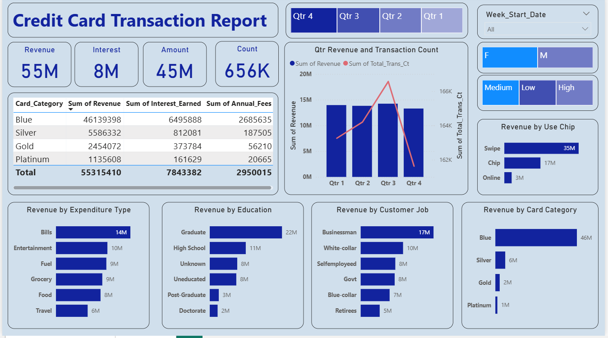
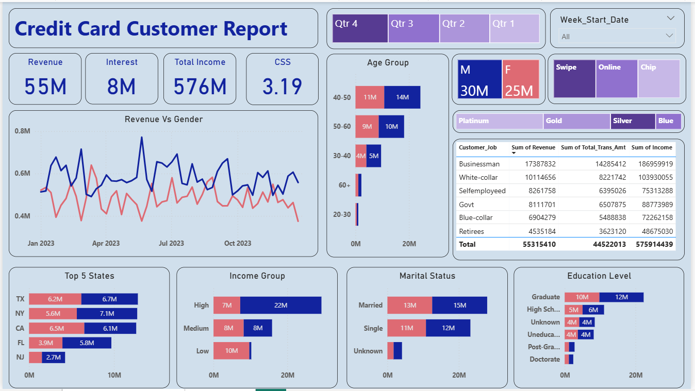

# 💳 Credit Card Financial Dashboard

> An end-to-end analytics project using SQL for data extraction and Power BI for interactive dashboards — analyzing 656K credit card transactions to uncover revenue trends, customer behavior, spending patterns, and financial KPIs across card categories, demographics, and geographies.

---

## 📋 Overview

This project presents an interactive Power BI dashboard built on credit card transaction and customer data. It covers two reporting views — a **Transaction Report** and a **Customer Report** — offering a 360° view of revenue performance, spending patterns, and customer segmentation. The dashboard enables stakeholders to monitor KPIs, identify high-value customer segments, and make data-driven decisions.

---

## ❓ Problem Statement

Credit card companies handle millions of transactions but need structured analysis to understand where revenue is coming from and which customer segments are most valuable. This project aims to answer:

- Which card categories and customer segments generate the most revenue?
- What are the dominant spending categories and payment methods?
- How does revenue trend across quarters and weeks?
- Which states, age groups, and income levels contribute most to the business?
- How do male and female customers compare in spending behavior?

---

## 📁 Dataset

| Attribute | Detail |
|---|---|
| Tables | `credit_card` (transaction data) · `customer` (demographic data) |
| Key Columns | Card Category, Transaction Amount, Transaction Type (Chip/Swipe/Online), Customer Job, Education Level, Age Group, Income Group, Marital Status, State, Week, Quarter, Revenue, Interest Earned, Annual Fees, Customer Satisfaction Score |

---

## 🛠️ Tools & Technologies


- **MySQL** — Database creation, data import, data storage and structured querying
- **Power BI** — Two-page interactive dashboard with DAX measures, slicers, and KPI cards

---

## 🔄 Methods

### Step 1 — Database Setup

```sql
-- Database and table setup
CREATE DATABASE credit_card;
USE credit_card;

-- Import credit_card.csv and customer.csv into respective tables
```
### Step 2 — Database Connection
Connected Power BI directly to the MySQL database using the native MySQL connector.

### Step 3 — DAX Measures
Created calculated measures for age group, income group, curent week revenue, previous week revenue.

### Step 4 — Dashboard Design
Built two report pages: a Transaction Report and a Customer Report, each with cross-filtered visuals.

---

## 💡 Key Insights

- **Blue card dominates** — ₹46M revenue out of ₹55M total (83%), with ₹6.5M interest earned and ₹2.7M in annual fees
- **Businessmen are the top customer segment** — ₹17M revenue, ₹14.3M transaction amount, ₹187M total income
- **Swipe transactions lead** at ₹35M — online transactions at just ₹3M, showing low digital adoption
- **Bills are the top spending category** at ₹14M, followed by Entertainment (₹10M) and Fuel (₹9M)
- **Graduate customers** generated the most revenue (₹22M) — significantly ahead of High School (₹11M)
- **40–50 age group** is the most valuable demographic at ₹14M revenue
- **TX leads all states** at ₹7.1M, followed by NY (₹6.7M) and CA (₹6.5M)
- **Male customers** slightly outspent female customers — ₹30M vs ₹25M
- **Q3 had the highest transaction count** (166K) while revenue also peaked in Q3
- **Customer Satisfaction Score (CSS) is 3.19** — indicating room for improvement in customer experience

---

## 📸 Dashboard Screenshots





---
## ✅ Results & Conclusion

The dashboard successfully delivers a real-time connected analytics solution for credit card financial data, combining SQL-based data preparation with interactive Power BI reporting.

Key conclusions:
- **Blue card is the growth engine** — any business strategy should prioritize retention and upselling within this segment
- **Digital payment adoption is critically low** — online transactions at ₹3M vs swipe at ₹35M signals a major opportunity for digital push campaigns
- **Businessmen and graduates are the highest-value segments** — targeted offers for these groups could significantly boost revenue
- **CSS of 3.19 out of 5** suggests customer satisfaction needs attention — linking this to transaction complaints or service delays could reveal the root cause
- **TX, NY, CA dominate** — regional marketing investment in these states is well justified by the data

---
## 🙋 Author

**Apurva Pandita**  
[LinkedIn](https://www.linkedin.com/in/apurva-pandita-b51812272/) · [GitHub](https://github.com/ApurvaPandita) · apandita04@gmail.com
